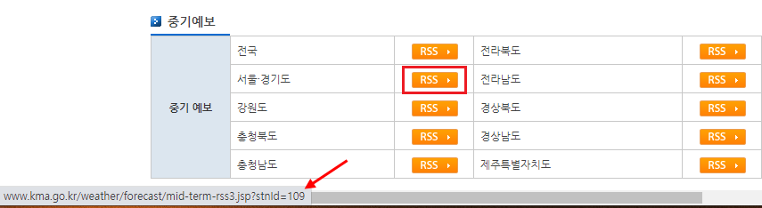
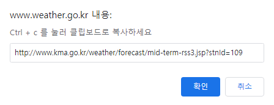

## 자료 수집하기

!!! info    
    
    URL 관련 작업을 위한 모듈로 **urllib** , HTTP의 다양한 요청과 처리를 위해 **urllib.request** 를 사용한다.

### 이미지 다운로드

[**request**][urllib.request] 의 [**urlretreive()**][urllib.request.urlretrieve] 를 이용해서 구글 로고 이미지를 다운로드 해보자.

``` py

import urllib.request

# 구글 이미지 주소
url = 'https://www.google.com/images/branding/googlelogo/1x/googlelogo_color_272x92dp.png'
filename = 'google_logo.png'

print('>> 다운로드 시작')
# 다운로드 하기
urllib.request.urlretrieve(url, filename)

print('{} 에서 {} 로 저장'.format(url, filename))

```

- URL 에 해당하는 데이터를 가공하기 위해서는 파일로 바로 저장하지 않고 메모리에 보관해야한다.
- [**request.urlopen()**][urllib.request.urlopen] 으로 메모리에 저장할 수 있다.

``` python
import urllib.request
url = 'https://www.google.com/images/branding/googlelogo/1x/googlelogo_color_272x92dp.png'
filename = 'google_logo_memo.png'

print('>> 다운로드 시작')
                                    # 다운로드 해서 메모리에 저장
down = urllib.request.urlopen(url)  # class 'http.client.HTTPResponse'
memo = down.read()                  # class 'bytes'

                                    # 파일에 저장
with open(filename, mode='wb') as sf:
    sf.write(memo)

print('{} 에서 {} 로 저장'.format(url, filename))

```

[urllib]: https://docs.python.org/3/library/urllib.html
[urllib.request]: https://docs.python.org/3/library/urllib.request.html
[urllib.request.urlretrieve]: https://docs.python.org/3/library/urllib.request.html?highlight=urlretrieve#urllib.request.urlretrieve
[urllib.request.urlopen]: https://docs.python.org/3/library/urllib.request.html?highlight=urlopen#urllib.request.urlopen

-------------

### XML, HTML 다운로드

**국회의원 인적 정보 공개 API** 로 XML 데이터를 다운로드 한다.

``` py
import urllib.request

url = 'https://open.assembly.go.kr/portal/openapi/nwvrqwxyaytdsfvhu'
                                    # 국회의원 인적정보 Open API
down = urllib.request.urlopen(url)
data = down.read()

txt_xml = data.decode('utf-8')
print(txt_xml)

```

URL에 정보를 추가해서 요청해서 자료를 다운로드 해본다. 이를 위해 기상청의 [**RSS 서비스**][weather_rss] 를 사용해보자.

!!! info

    **RSS(Really Simple Syndication, Rich Site Summary)** 란 블로그처럼 컨텐츠 업데이트가 자주 일어나는 웹사이트에서, 업데이트된 정보를 쉽게 구독자들에게 제공하기 위해 XML을 기초로 만들어진 데이터 형식입니다. RSS서비스를 이용하면 업데이트된 정보를 찾기 위해 홈페이지에 일일이 방문하지 않아도 업데이트 될 때마다 빠르고 편리하게 확인할 수 있습니다. [출처- 기상청 RSS 서비스][weather_rss]

기상청 RSS 서비스 페이지에서 테이블 형태로 지역별로 RSS 서비스 요청에 대한 정보를 확인할 수 있다. 

{: width="700" height="500"}

그림과 같이 서울/경기도 지역의 RSS 버튼에 마우스 커서를 올리면 **http://www.kma.go.kr/weather/forecast/mid-term-rss3.jsp?stnId=109** 를 확인할 수 있다. 

RSS 버튼을 클릭하면 크롬 브라우저에서는 아래 그림과 같은 팝업 창이 생성되는 것을 확인할 수 있다.

{: width="400" height="500"}


**stnId=109** 가 지역을 구분하기 위해 서울/경기도에 해당하는 정보이다. RSS 서비스 요청시에 추가해서 보내는 지역번호이다.

``` py
import urllib.request, urllib.parse

                                # http://www.kma.go.kr/weather/forecast/mid-term-rss3.jsp?stnId=109
rss_url = 'http://www.kma.go.kr/weather/forecast/mid-term-rss3.jsp?stnId=109'
rss_data = urllib.request.urlopen(rss_url).read()
rss_txt = rss_data.decode('utf-8')
print(rss_txt)

kma_rss = 'http://www.kma.go.kr/weather/forecast/mid-term-rss3.jsp'
ids = ['109', '105', '131']     # 서울/경기, 강원도, 충북

for id in ids:
    rss_url = kma_rss + '?' + 'stnId=' + id
    rss_data = urllib.request.urlopen(rss_url).read()
    rss_txt = rss_data.decode('utf-8')
    print(rss_txt)              # XML 출력


```

[weather_rss]: http://www.weather.go.kr/weather/lifenindustry/sevice_rss.jsp

!!! info

    GET 방식의 URL
    **``http://target.com?key1=value1&key2=value2``**
    >
        `키 = 값` 이 여러개면 `&` 로 구분한다.


### BeautifulSoup 활용


