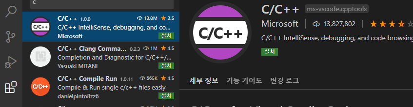
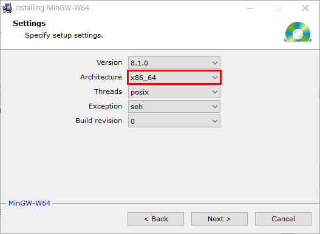
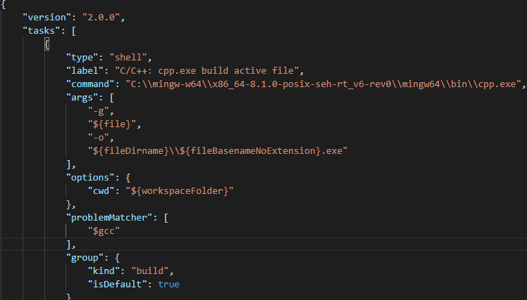
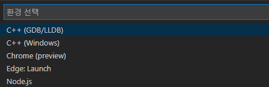
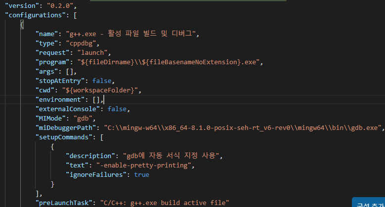
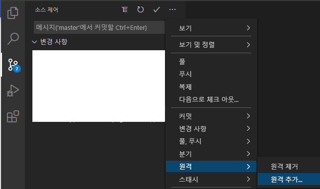

## MingGW + VS Code

구글 테스트를 수행하기 위해서는 사전에 필요한 것은 C++ 개발 환경이다.

Windows 운영 체제,  **Gnu gcc 컴파일러**, **Visual Studio Code** 를 활용한 환경 설정에 대해서 설명한다. 
참고로, **Git** 은 이미 설치되어 있는 상태에서 시작한다.


### VS Code + MinGW 설치

!!! note "참고"
    - [VS code 설치](https://code.visualstudio.com/)
    - [MinGW 64 설치](http://mingw-w64.org/doku.php/download/mingw-builds)
    - [VS Code 에서 GCC(MinGW) 사용하기](https://code.visualstudio.com/docs/cpp/config-mingw)

1. ==Visual Studio Code== 를 설치한다.

2. VS Code에서 C/C++를 사용하기 위한 확장(`extension`) ==MinGW 64== 를 차례로 설치한다.

    {: width="500" height="300"}

    - 그림에서 보이는 C/C++ 확장을 찾아서 설치한다.

3. ==MinGW 64== 설치

    - installer 를 다운받아서 실행한다.

    {: width="500" height="500"}

    - **Architecture** 를 **x86_64** 로 선택한다.

    {: width="500" height="500"}

    - 설치 폴더를 설정하고 설치한다.

4. ==MSYS2 pachage== 설치

    - https://www.msys2.org/

5. **MinGW-64** 의 ``bin`` 폴더, **msys2** 의 ``bin`` 폴더를 ``PATH`` 환경 변수에 추가한다.

    - 예> ``C:\mingw-w64\x86_64-8.1.0-posix-seh-rt_v6-rev0\mingw64\bin``
    - MinGW 가 정상적으로 설치 되었음을 명령프롬프트 창에서 확인한다.

    ``` console
    g++ --version
    gdb --version
    ```

### 코드 작성, 빌드, 실행

- 명령창에서 다음과 같이 폴더를 생성하고 **VS Code** 를 실행시킨다.

``` console
mkdir projects
cd projects
mkdir helloworld
cd helloworld
code .
```

- **작업영역** 내의 `.vscode` 폴더에 다음 **3** 개의 파일을 생성할것이다.

    - ==tasks.json== : 빌드 명령들
    - ==launch.json== : 디버거 설정들
    - ==c_cpp_properties.json== : 컴파일러 경로(compiler path) 와 인텔리센스(IntelliSense) 설정들

- C++ 예제 파일(`helloworld.cpp`)을 생성하고 코드를 작성한다.

- **tasks.json** 파일을 생성해서 **VS code** 에게 빌드에 필요한 정보를 제공해야 한다.
- **터미널(T) -> 기본 빌드 작업 구성** 메뉴를 선택하면 사전에 정의된 C++ 컴파일러들을 드롭다운 리스트로 보여준다.
- **g++.exe build active file** 을 선택하면 ``tasks.json`` 파일이 ``.vscode`` 폴더에 생성되고, 편집창에 오픈된다.

    {: width="700" height="600"}

    - ``args``  가 **g++** 에 전달되는 명령라인 인자들이다. 
    - **g++** 은 `${file}` 을 컴파일하고, 실행파일을 `${fileDirname}` 폴더에 생성한다. 실행파일은 ``$fileBasenameNoExtension}.exe``
    

!!! info "Variable Reference"

    - https://code.visualstudio.com/docs/editor/variables-reference

> 참고

- ``group`` 의 ``"isDefulat": True`` 가 기본 빌드 작업을 의미한다.
- 여러개의 소스 파일을 컴파일하려면 `${file}` 을 `"${workspaceFolder}\\*.cpp"` 로 수정한다.


#### 디버깅

 - ==F5== 를 눌러서 GDB 디버거를 시작하려면 `launch.json` 파일을 생성한다.

-  **실행 -> 구성추가** 를 선택하고, **C++ (GDB/LLDB)** 를 선택한다.

{: width="500" height="300"}

- 드롭다운 리스트에서 **g++.exe - 활성 파일 빌드 및 디버그** 을 선택한다.

- VS code가 `launch.json` 파일을 생성한다.

{: width="700" height="600"}

- ``stopAtEntry`` 를 ``true`` 로 설정하면 디버거가 **main** 함수를 시작할 때 멈춘다.


### VS Code에서 Git 연동

- VS Code 와 ==Git== 을 연동하려면 **Git** 을 설치해야 한다.
- https://git-scm.com/

- Git 계정 정복를 설정한다. 윈도우 자격증명을 사용할 수도 있다.

``` console
git config --global user.name username
git config --global user.email user@email.mail
```

- Github 리포지터리 연동: **소스제어-> ... -> 원격 -> 원격추가**

{: width="500" height="500"}


