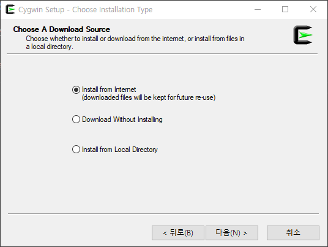
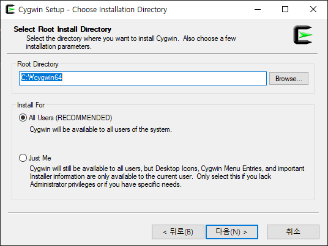
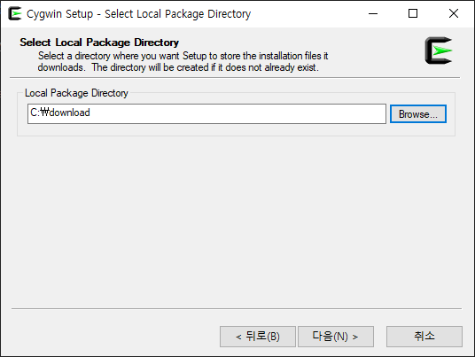
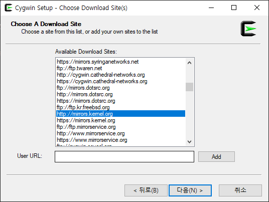
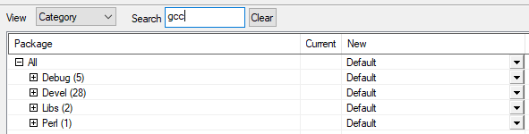
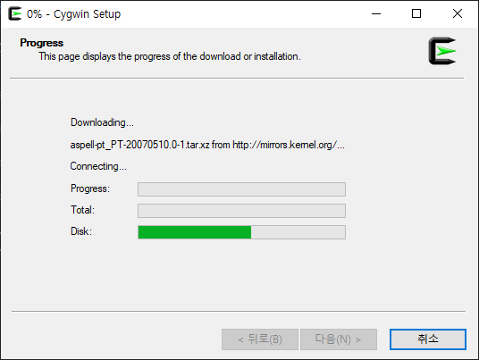

## Cygwin + GoogleTest

- ==Cygwin== 은 윈도우즈에서 리눅스 환경을 지원하는 **GNU** 와 오프소스 도구들을 제공한다.


### Cygwin 설치하기

- https://www.cygwin.com/setup-x86_64.exe 다운로드.
- 설치파일을 실행한다.

    {: width="500" height="500"}

- 설치 폴더를 선택한다.

    {: width="500" height="500"}

- 다운로드한 패키지를 저장할 폴더를 선택한다.

    {: width="500" height="500"}

- 미러사이트를 선택한다.
- ftp://ftp.kr.freebsd.org
- ftP://ftp.kaist.ac.kr

    {: width="500" height="500"}

- ==gcc-g++ core, gcc-core, cmake, make, git== 등을 설치하도록 선택한다.

    {: width="500" height="300"}


- 설치가 진행된다.

    {: width="500" height="500"}

### 빌드 구글 테스트

- **google test** 소스 파일 다운로드

- ``googletest`` 리포지터리를 복제한다.
``` console
git clone https://github.com/google/googletest.git
```

- 또는, 소스 압축파일 다운로드하고, 압축을 푼다.

- 구글 테스트 폴더에서 다음을 수행한다.
```console
mkdir build
cd build
cmake ..
make
make install
```

- 빌드된 라이브러리 파일을을 **/usr/lib** 에 복사한다.
```console
cp /usr/local/lib/libtg*  /usr/lib
```
    - /usr/local/lib/libgmock.a       
    - /usr/local/lib/libgtest.a     
    - /usr/local/lib/libgmock_main.a  
    - /usr/local/lib/libgtest_main.a


