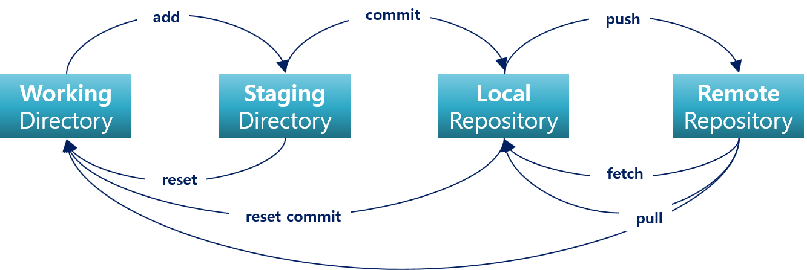

# git 사용하기

### Git 설치하기

- http://git-scm.com    
- 시작메뉴> 모든 프로그램 > Git > Git Bash 실행
- `git --version` 으로 설치확인

### 초기 설정

- git 설정은 사용자 홈의 .gitconfig 파일에 저장.
- 직접 편집하거나 config 명령어를 사용.

``` sh
$ git config --global user.name "<사용자명>"
$ git config --global user.email "<메일 주소>"
```

### 저장소 만들기

특정 폴더를 Git의 저장소로 등록하려면, 해당 폴더로 이동하여 init 명령어를 수행.

``` sh
$ git init
```

### 파일 커밋하기

새로운 파일을 작성하고 원격 저장소에 등록하기

참고> 폴더의 작업트리와 인덱스 상태를 확인하기.

``` sh
$ git status
```

그러면, 추적 대상이 되지 않은 파일(untracked files)에 대한 내용을 볼 수 있다.

- 파일을 인덱스에 등록하는 명령어는 add (staging))

``` sh
$ git add file..
```

현재 폴더의 모든 파일을 인덱스에 등록

``` sh
$ git add .
```

- 커밋 실행하기

``` sh
$ git commit -m "주석"
```

- 변경 이력 확인하기

``` sh
$ git log
```

- GUI 도구 활용하기

``` sh
$ gitk
```

### 원격 저장소에 push

- 원격 저장소를 추가하려면, remote 명령어를 사용

``` sh
$ git remote add name url
```

- repository는 push 경로의 주소, refspec은 push 할 브랜치를 지정

``` sh
$ git push repository refspec
```


### 원격 저장소 복제
- repository 는 원격 저장소의 URL, directory는 복제할 폴더명

``` sh
$ git clone repository directory
```

### 원격 저장소에서 pull

``` sh
$ git pull repository refspec
```

## Git 기능 관련

{: width="700" height="500"}

- 그림 출처: https://www.jrebel.com/blog/git-cheat-sheet

## Git Workflow