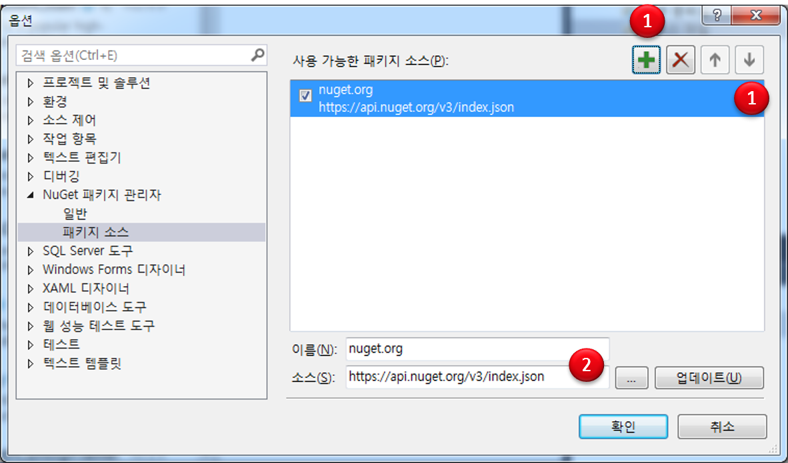

Googletest + Visual Studio
============================================

!!! note
    Googletest 를 사용하기 위한 준비 환경에 대한 내용이다.

VS Express 2017 for Windows Desktop
----------------------------------------------------------------------

VS 2017 Community에서는 GoogleTest를 기본적으로 지원하고 있지만 데스크탑용 VS Express 2017 에서 Googletest를 사용하려면 추가적인 작업이 필요하다. 
여기서, 소개하는 방법이 가장 좋은 방법인지는 확신할 수 없다.

미리 VS Express 2017 for Desktop을 설치한 상태에서 진행한다. 
    
- [*VS Express 2017 for Windows Desktop 설치*](https://visualstudio.microsoft.com/ko/vs/express/)

다음은 Nuget에서 Googletest 패키지를 설치하는 방법이다.

- 먼저, 비주얼 스튜디오를 실행하고 프로젝트를 생성한다. 빈프로젝트 또는 콘솔 응용으로 생성한다.
- 프로젝트를 생성한후 솔류션 탐색기에서 프로젝트를 선택하고 오른쪽 마우스를 클릭해서 팝업창을 생성한다.
- 팝업창에서 ==Nuget 패키지 관리== 메뉴를 클릭한다.
  - 상단의 프로젝트 메뉴에서도 가능하다.

{: width="300" height="300"}

- 중앙에 Nuget 패키지 관리자가 실행되면 다음과 같이 보인다.

{: width="400" height="400"}

- 검색창에서 ==googletest== 를 입력해본다.

- 그림의 화살표가 가리키는 영역에 아무 것도 나타나지 않고, 우상단 빨간 선의 드롭박스에도 아무 내용이 없다면 우상단의 바퀴 모양을 클릭해서 옵션창을 생성한다.

{: width="400" height="400"}
  
- 옵션창에서 Nuget 패키지 관리자 --> 패키지 소스를 선택한다..
- 오른쪽 화면에 사용 가능한 패키지 소스에 대한 내용이 빈 상태일 것이다.
- 먼저, 우상단의 초록새 십자아이콘의 버튼을 클릭해서 새로은 패키지 소스를 추가한다.
- 그리고, 아래쪽 이름과 소스에 Nuget에 대한 정보를 입력하고 업데이트를 클릭한다.

- 이제 Nuget 패키지 관리 창에서 다음 패키지를 찾아서 설치한다.
  - ==Microsoft.googletest.v140.windesktop.msvcstl.static.rt-dyn==
  - ==goolegmock==

VS  2017 Community
----------------------------------------------------------------------

