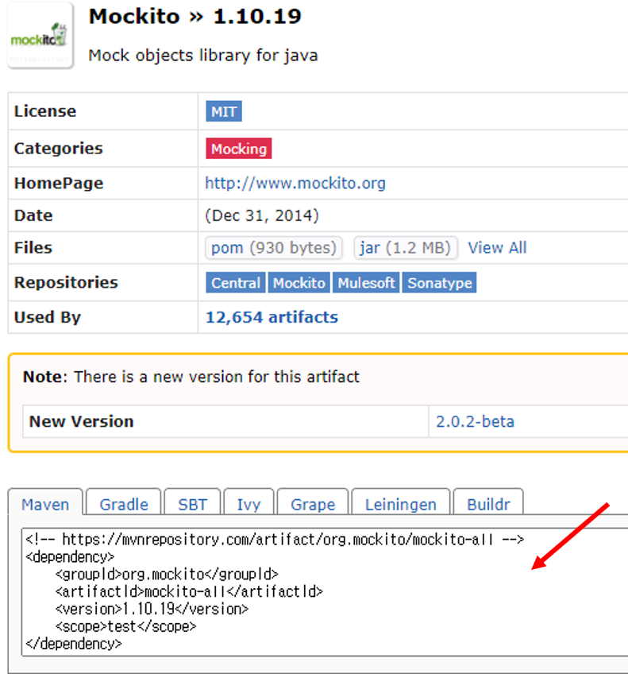
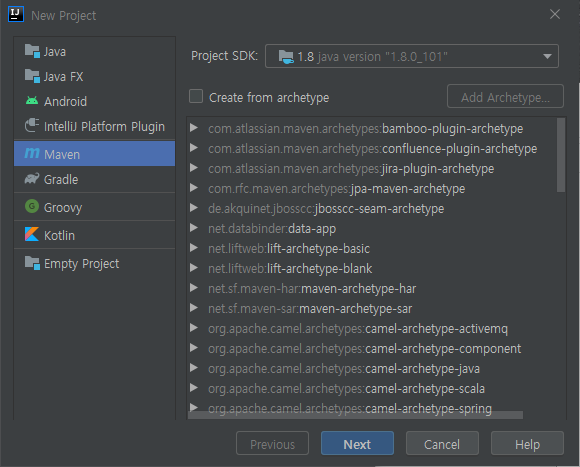
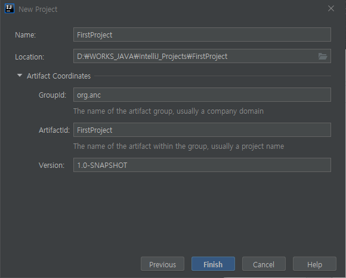
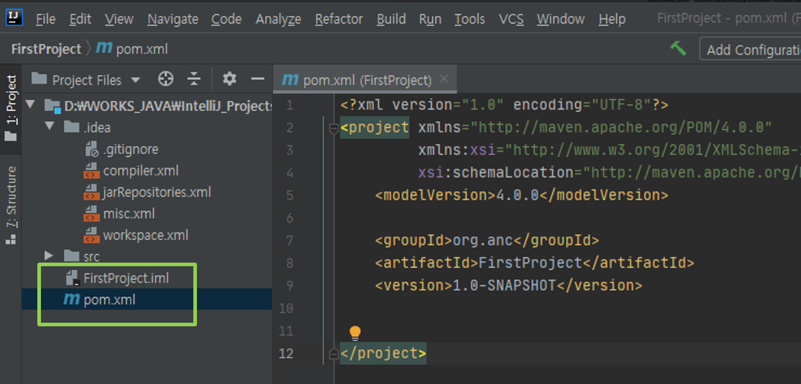
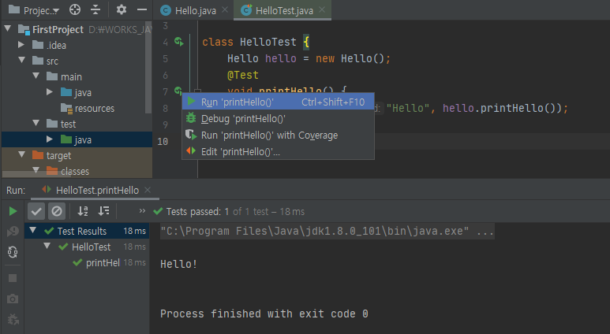
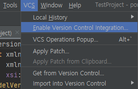
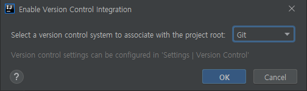
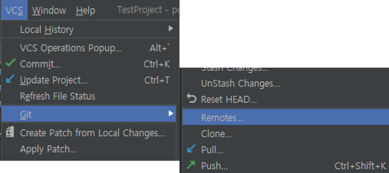
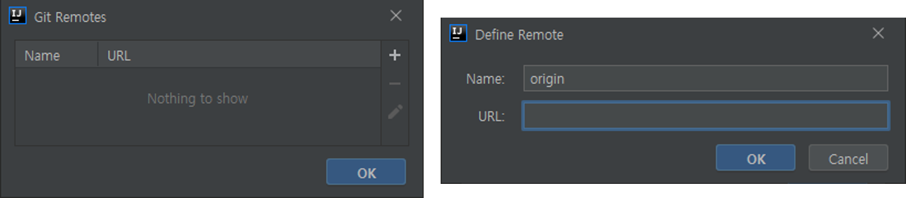

# JUnit5 실습 환경


## 환경 설정

### 1. JKD 설치

- [JDK SE Download](https://www.oracle.com/kr/java/technologies/javase-downloads.html) (또는, 줄루-OPEN JDK로 설치)

- JDK SE 8 ( *jdk-8u251-windows-x64.exe* 권장). 최신은 SE 14 버전.

- 시스템 변수 ``path`` 에 설치한 JDK 추가 하기 
    - 제어판 -> 시스템 -> 정보 -> 시스템정보 -> 고급시스템설정/환경변수
    - JDK의 실행 파일 위치 ``C:\Program Files\Java\jdk1.8.0_251\bin`` 추가

- 명령 프롬프트창에서 ``java -version`` 실행해서 확인.

### 2. Maven 설치

- 자바 프로젝트의 빌드를 자동화 해주는 도구
    - Build, Package, Test, Report, Release

- **IntelliJ** 를 설치해서 사용한다면 따로 설치할 필요 없음.
    - http://maven.apache.org/download.html  (Binary zip archive-3.6.3 다운로드)
    - zip 파일을 압축해제, bin폴더아래의 내용을 원하는 경로로 이동(C:\Program Files\)

- 환경 변수 설정
    - 시스템변수 ``MAVEN_HOME`` 등록 : ``C:\Program Files\apache-maven-3.6.3``
    - 환경변수 ``PATH`` 편집 : ``%MAVEN_HOME%\bin`` 추가

- 명령 프롬프트창에서 ``mvn -version`` 실행해서 확인.


### 3. IntelliJ 설치

- JUnit 실습 및 팀 프로젝트를 위한 IDE 
    - https://www.jetbrains.com/idea/download/ (**Community ver.설치**)
	- 64-bit laucher, Add PATH, Add OpenAsPJ, Create Assoc/.java 체크후, 설치

!!!note "Maven 관련 설정 파일"
    - MAVEN_HOME/settings.xml: 모든 사용자에 적용되는 전역적인메이븐 설정 정보
    - USER_HOME/.m2/setting.xml: 특정 사용자에 적용되는 메이븐 설정 정보


### 4. hamcrest, mockito, approvaltests

- https://mvnrepository.com/ 에서 ``필요모듈/ver.의 jar화일`` 다운로드
    - 예> mockito 1.10.19
- MVN Repository에서 mockito 를 검색해서 원하는 버전을 클릭하면 다음과 같은 화면을 볼 수 있다. 

{: width="400" height="400"}

- 그림의 화살표가 가리키는 Maven의 dependency 정보를 얻을 수 있다.

=== "mockito"
    ```xml
    <!-- https://mvnrepository.com/artifact/org.mockito/mockito-all -->
    <dependency>
        <groupId>org.mockito</groupId>
        <artifactId>mockito-all</artifactId>
        <version>1.10.19</version>
        <scope>test</scope>
    </dependency>
    ```
=== "hamcrest"
    ```xml
    <!-- https://mvnrepository.com/artifact/org.hamcrest/hamcrest-all -->
    <dependency>
        <groupId>org.hamcrest</groupId>
        <artifactId>hamcrest-all</artifactId>
        <version>1.3</version>
        <scope>test</scope>
    </dependency>
    ```
=== "approvaltests"
    ```xml
    <!-- https://mvnrepository.com/artifact/com.approvaltests/approvaltests -->
    <dependency>
        <groupId>com.approvaltests</groupId>
        <artifactId>approvaltests</artifactId>
        <version>4.0.2</version>
    </dependency>
    ```

----------------------------------

## Intellij 시작하기

### Maven Project 해보기

- Maven Project 생성하기
	- **File -> New -> Project** 에서 **Maven** 선택

{: width="400" height="400"}


- 프로젝트 이름(**FirstProject**), 위치 지정
    - 필요 시 Artifact / Groupid(optional) 설정

{: width="400" height="400"}

- 프로젝트 정보 확인 (pom.xml, {프로젝트이름}.iml)	
    - pom : Project Object Model    

{: width="600" height="500"}

### 간단한 예제 작성하기

- ``.java`` 파일 생성하고 편집
	- 프로젝트 창에서 ``src/main/java`` 선택, 마우스 오른쪽 클릭 **New -> JavaClass** 선택해서 ``.java`` 화일 추가 (예> Hello.java)
	- Hello.java 작성한다.
	
- ``Hello`` 클래스에 대한 테스트 코드를 작성한다. 
    - **Hello.java** 편집기의 ``Hello`` 클래스 이름 위에서 오른쪽 마우스 클릭해서 팝업 메뉴를 생성한다.-
    - **ShowCotextActions -> CreateTest** 메뉴를 선택 
    - HelloTest.java 파일 작성
    - 편집기 창에서 우클릭 후, ``Add JUnit5.x to classpath`` 선택 
	- pom.xml junit version 변경 (RELEASE -> 5.5.2)
	- 필요한 모듈이 있을 경우, 해당 dependency를 ``pom.xml`` 에 추가 

{: width="600" height="600"}

- 예제 코드

=== "Hello.java"
    ```java
    public class Hello {
        String printHello(){
            System.out.println("Hello!");
            return "Hello!";
        }
    }
    ```
=== "HelloTest.java"
    ```java
    import org.junit.jupiter.api.Test;
    import static org.junit.jupiter.api.Assertions.*;

    class HelloTest {
        Hello hello = new Hello();
        @Test
        void printHello() {
            assertEquals("Hello!", hello.printHello());
        }
    }
    ```

------------------------

- 실행시켜서 결과를 확인한다.

{: width="600" height="600"}


## Git에 연동하기

Intellij 에서 생성한 Maven 프로젝트를 Git으로 관리하기 위한 설정 방법이다.

- Github에 Repository를 생성한다.

- Maven 프로젝트를 Git 로컬 리포지터리로 변경한다.
- **vcs -> Enable Version Control Integreation** 메뉴를 선택한다.

{: width="400" height="400"}

- 아래 그림의 창에서 보이면 원하는 vcs 종류를 선택한다. Git이 기본으로 설정되어 있다.

{: width="600" height="600"}

- 설정이 끝나면 왼쪽 모서리에 Git 윈도우가 활성화 되는 것을 알 수 있다.

{: width="300" height="300"}

- Github에 생성한 리포지터리를 **Remote** 로 설정한다.
- **vcs -> Remotes..** 를 선택한다.

{: width="600" height="600"}

- ``+`` 아이콘을 눌러서 **Remote** 리포지터의 URL을 입력한다.

{: width="600" height="600"}


- pull, push 등을 통해 정상적으로 동작하는지 확인해본다.
