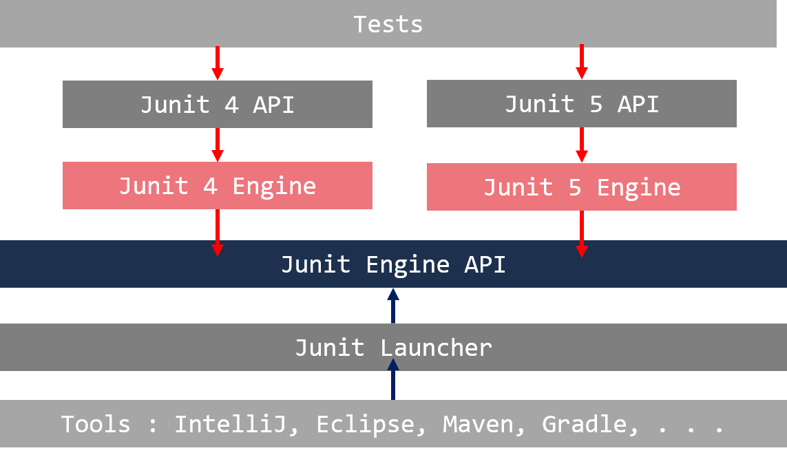

JUnit
=====================

!!! info
    이 내용은 ==Java Unit Testing with JUnit 5==[^1] 의 내용과 ==JUnit 사이트==[^2] 를 참조해서 작성함.

JUnit 소개[^1] [^2]
-------------------------------

- Kent Back 과 Erich Camma 에 의해 작성된 가장 인기있는 **Java** 유닛 테스팅 프레임워크 중 하나다.
- SUnit 에 기반
  - 1997년 Kent Back에 의해 Smalltalk 으로 작성
  - 사실상 표준으로 많은 다른 언어에서 채택함
- Martin Fowler에 의해 중요성이 강조되었다.

### JUnit 5

- JUnit 4 의 단점들을 보완하기 위해 JUnit **Lambda** 프로젝트가 시작
  - JUnit Lambda는 JUnit 5의 코드 네임
- JUnit 3.8 이상 버전을 지원
- JAVA 8 이상 필요함.

**JUnit 5 는 3개의 컴포넌트로 구성[^2].**

{: width="500" height="500"}

> JUnit Platform

- JVM을 동작시킨다.
- 테스팅 프레임워크를 개발하기 위해 사용되는 TestEngine API 포함
- Gradle, 또는 Mave 같은 빌드 도구들에게 콘솔 런처(Console Launcher)를 제공

> JUnit Jupiter

- 테스트 작성을 위해 새로운 프로그래밍 모델을 제공
- 새로운 확장 메카니즘을 포함
- JUnit Platform에서 정의한 TestEngine API 를 구현
  

> JUnit Vintage

- JUnit 3 과 JUnit 4 의 TestEngine 구현

| 주요 모듈                   |    설명 |
|:---------------------------------|:------------------------------------------------------------|
|Junit-jupiter-api                        |   테스트 코드 작성에 필요한 API    |
|Junit-platform-launcher            |  외부 도구가 사용하는 런처 API 정의. 런처는 테스트의 발견, 필터링, 실행에  사용 |
|Junit-platform-engine               |  당신 자신의 TestEngine을 작성하기 위한 API 제공. TestEngein은 테스트의 발견과 실행의 책임을 가짐|
|Junit-jupiter-engine                   |  JUnit 5 를 위한 Junit-platform-engine API 구현|
|Junit-vintage-engine                 |  JUnit 3 과 JUnit 4 의 Junit-platform engine API 구현 |
|Junit-platform-comons             | 모듈 사이에 공통으로 사용되는 유틸리티들 |
|Junit-platform-console             |  ConsoleLauncher 라고 불리는 런처의 구현 |
|Junit-platform-gradle-plugin    | JUnit 5 테스트를 싱행시키는 Gradle 플러그인 |
|Junit-platform-surfire-provider | JUnit 5 에 Maven 통합을 제공  |

[^1]:
    S. Gulati, and R. Sharma, Java Unit Testing with JUnit 5: Test Driven Development with JUnit 5, 1st ed. edition. New York, NY: Apress, 2017.

[^2]:
    JUnit site - junit.org/junit5

### 실습: InteLLiJ IDEA 

### Eclipse

